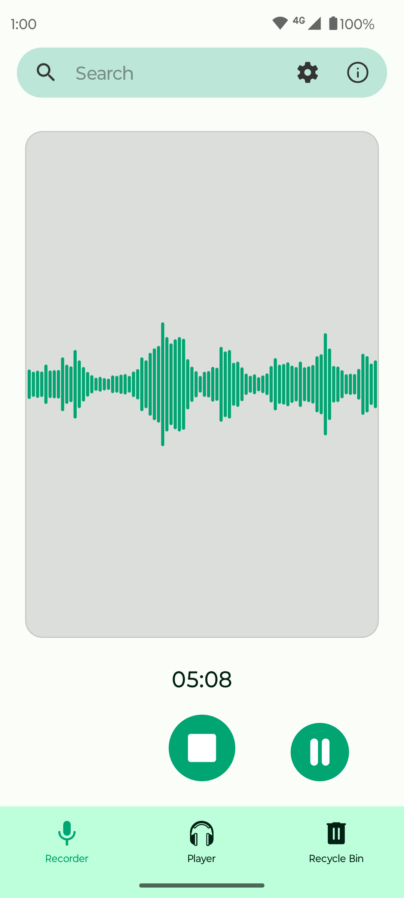
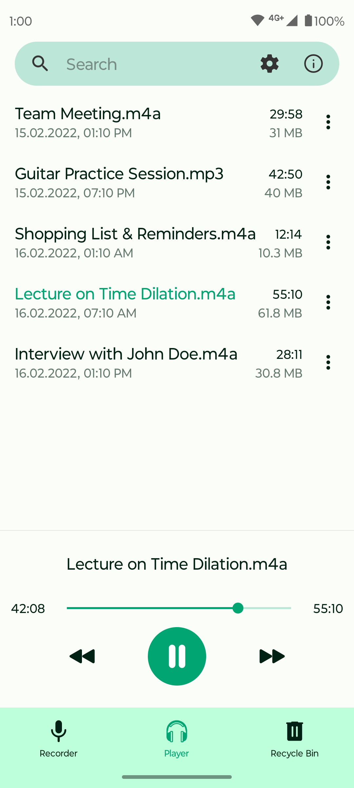
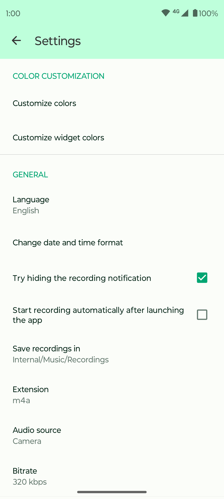

# Fossify Voice Recorder

  

Introducing Fossify Voice Recorder, an intuitive and customizable audio recording app.

**🎙️ Versatile Recording Options:**  
Fossify Voice Recorder supports a range of audio formats, allowing for both storage-efficient and high-fidelity recordings, with customizable filename formatting.
Currently supports AAC, Opus, and MP3 (experimental).

**🚀 Clean Interface:**  
Enjoy a streamlined and ad-free experience, with real-time sound volume visualization, a widget for quick recordings, and configurable colors and themes.

**🔒 Private & Offline:**  
Fossify Voice Recorder operates completely offline, and does not collect any user data, ensuring all your recordings remain on your device and under your control at all times.

**🌐 Free & Open-Source:**  
Fossify Voice Recorder is fully free and open-source, granting you the freedom to use the app as you please, without compromise.

➡️ Explore more Fossify apps: https://www.fossify.org 
➡️ Open-Source Code: https://www.github.com/FossifyOrg 
➡️ Join the community on Reddit: https://www.reddit.com/r/Fossify 
➡️ Connect on Telegram: https://t.me/Fossify

